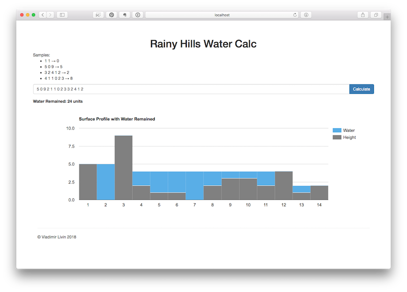

# Rainy Hills

Rainy Hills application calculates the volume of water which remains after the rain for
given surface profile represented by array of integers.

It features great user interface and can be deployed to any Java EE 7 compatible app server, although
Wildfly application server is recommended.



## Installation
Prerequisites:
 - Java JDK 8 http://www.oracle.com/technetwork/java/javase/
 - Maven 3 https://maven.apache.org
 - Wildfly 12 http://wildfly.org

Installation Steps:
1. Install & Run Wildfly application server.
    ```
    cd wildfly-12.0.0.Final
    ./bin/standalone.sh
    ```
    See documentation at http://wildfly.org for more details on running Wildfly on different platforms.    
2. Unzip rainyhills.zip archive or clone repository
    ```
    unzip rainyhills.zip
    cd rainyhills
    ``` 
    or
    ```
    git clone https://github.com/livin/rainyhills.git
    ```
3. Run test & build with maven
    ```
    mvn clean install
    ```
4. Deploy rainyhills to application server
    ```
    mvn package wildfly:deploy
    ```
    or deploy `rainyhills.war` located in `rainyhills/target/`
    to your application server.
    
## Usage
Open application at http://localhost:8080/rainyhills.
Specify your surface profile and click "Calculate".        
